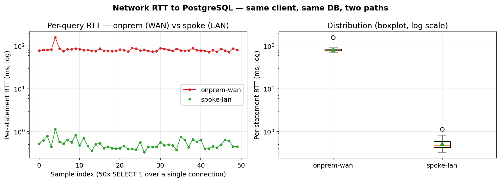
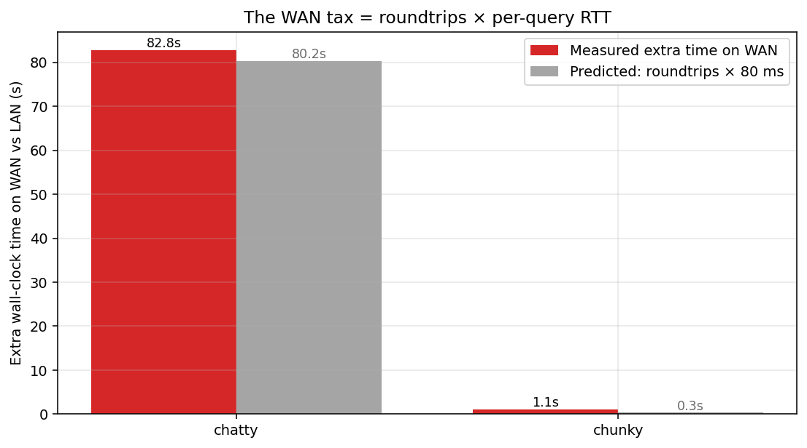
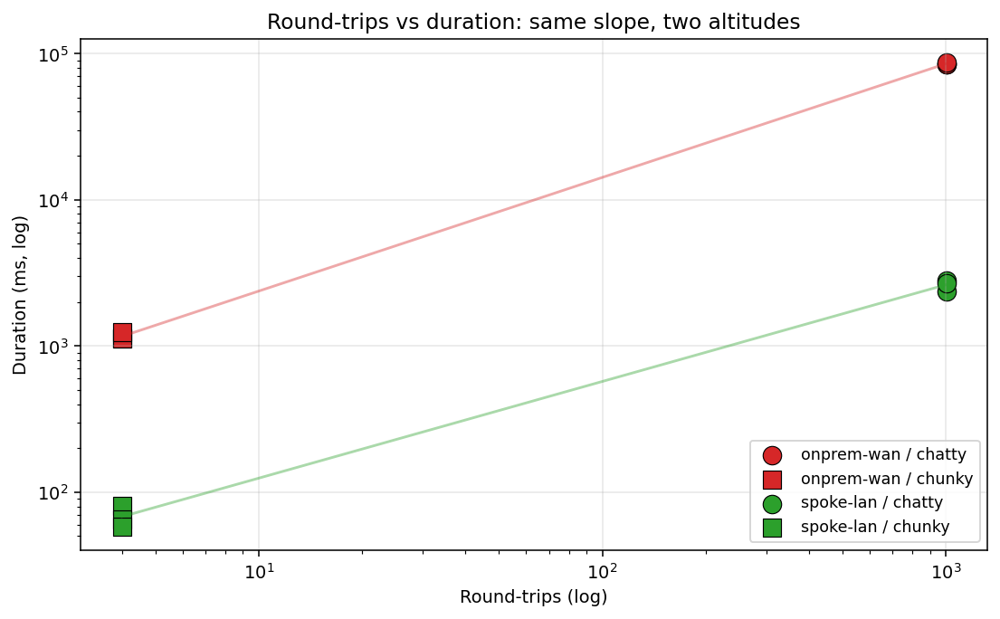
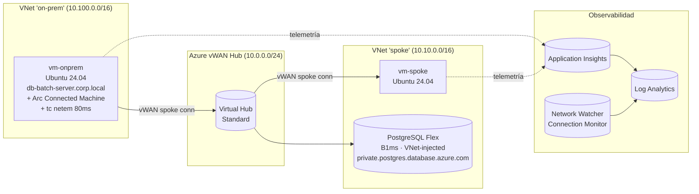

# Azure Hybrid Latency Lab

> Un laboratorio reproducible que **demuestra** el coste real de los procesos *chatty* (muchas idas y vueltas) contra una BBDD remota a través de una red híbrida — usando **Azure Virtual WAN** real, una VM Linux "on-prem" **conectada con Azure Arc**, un **PostgreSQL Flexible Server** real y **Application Insights** para medir cada round-trip.

[](LICENSE)
🇪🇸 Español · [🇬🇧 English](README.en.md) · [📖 Guía paso a paso](GUIA.md)

---

## ¿Por qué existe esto?

Patrón típico en arquitecturas híbridas: un proceso batch pesado on-prem habla con una BBDD en Azure a través de un ExpressRoute / VPN. La BBDD es rápida, el enlace es ancho, pero el batch tarda **horas** porque lanza miles de queries pequeñas. **Cada query paga el RTT completo de la WAN** (problema clásico N+1 / `ASYNC_NETWORK_IO`).

Este lab reproduce ese escenario de extremo a extremo en Azure y lo mide con números reales. La idea es separar de forma quirúrgica el efecto del **patrón de la aplicación** del efecto de la **distancia física**, ejecutando exactamente el mismo código contra exactamente la misma BBDD desde dos sitios distintos.

## Resultados reales medidos

| Workload | Round-trips | Spoke (LAN, ~0.5 ms) | On-prem (WAN, 80 ms simulados) | Slowdown WAN/LAN |
|---|---:|---:|---:|---:|
| `chatty` (N+1) | 1003 | **2.63 s** | **85.46 s** | **32.5×** |
| `chunky` (set-based) | 4 | 0.07 s | 1.16 s | 16.7× |

RTT por query medido con sonda dedicada (`SELECT 1;` × 50, 1 sola conexión):

| Entorno | p50 | p95 | max |
|---|---:|---:|---:|
| `spoke-lan` | **0.48 ms** | 0.80 ms | 1.14 ms |
| `onprem-wan` | **79.31 ms** | 89.13 ms | 158.40 ms |

El "impuesto WAN" predicho como `roundtrips × 80 ms` cuadra con el extra medido al céntimo (chatty: 80 s predicho vs 83 s medido). Confirma que el cuello de botella es la **latencia**, no la BBDD ni el ancho de banda.

📊 **Análisis completo con tablas y gráficas**: [`results/notebook/analysis.ipynb`](results/notebook/analysis.ipynb) (ya ejecutado, GitHub lo renderiza inline).

📁 **Datos crudos**: [`results/raw/`](results/raw/) — los 4 CSVs originales por entorno.





---

## Arquitectura



**Lo que se despliega:**
- 1× **Azure Virtual WAN** Standard + 1× hub
- 2× **VNets** (spoke + "on-prem") conectadas al hub
- 2× **VMs Ubuntu 24.04** Standard_B2s_v2 (una en cada VNet)
- 1× **PostgreSQL Flexible Server** B1ms con private DNS
- 1× **Log Analytics workspace** + 1× **Application Insights**
- 1× **Network Watcher Connection Monitor** probando TCP/5432 cada 60 s
- La VM "on-prem" se **onboardea con Azure Arc** (modo `MSFT_ARC_TEST=true` porque debajo es una VM de Azure) y se le inyecta `tc netem 80 ms ± 5 ms` en el egress para simular WAN

**Coste**: ~ **0,40 €/h** mientras está desplegado (el vWAN hub Standard se lleva 0,25 €/h).

---

## Cómo reproducirlo (resumen)

> 📖 **Para una guía detallada paso a paso, en español, con todos los comandos y outputs esperados**, lee [`GUIA.md`](GUIA.md).

### Pre-requisitos

- Suscripción Azure con permisos de Owner (o Contributor + User Access Administrator) sobre el RG.
- Herramientas locales: `az` CLI, `bicep` (viene con `az`), `ssh-keygen`, `bash` o PowerShell, Python ≥ 3.10 (sólo si quieres regenerar el notebook localmente).

### Despliegue rápido (4 comandos)

```bash
# 1. Generar par de claves SSH
ssh-keygen -t ed25519 -f ~/.ssh/hyblat_id_ed25519 -N '' -C hybrid-latency-lab

# 2. Login + seleccionar suscripción
az login
az account set --subscription "<TU_SUSCRIPCION>"

# 3. Desplegar la infraestructura (~25 min, dominado por el vWAN hub)
cd infra
./deploy.sh                        # imprime la PG_PASSWORD generada — GUÁRDALA

# 4. Onboarding + experimento + plot (one-shot, idempotente)
export PG_PASSWORD="<la_que_imprimió_deploy.sh>"
bash scripts/post_deploy.sh
```

`post_deploy.sh` hace **todo lo siguiente automáticamente**:

| Paso | Qué hace |
|---|---|
| 1 | Lee los outputs del despliegue (FQDN de PG, IPs, App Insights connection string) |
| 2 | Copia `chatty.py`, `chunky.py`, `seed.py`, `run_experiments.sh` a la VM on-prem |
| 3 | Ejecuta `setup_onprem.sh` en la VM on-prem (cambia hostname a `db-batch-server.corp.local`, instala deps, escribe `.env`, **inyecta `tc netem 80ms ± 5ms`**) |
| 4 | Copia `seed.py` a la VM spoke y siembra la BBDD con 5000 filas (sin latencia añadida, va por LAN) |
| 5 | Lanza `run_experiments.sh ITEMS=500 RUNS=3` en la on-prem (3 runs de chatty + 3 de chunky) |
| 6 | Descarga el CSV con los resultados a `results/` |
| 7 | Genera las gráficas PNG con `plot_results.py` |

### Repetir el experimento desde el spoke (LAN) y comparar

Para reproducir la comparación WAN-vs-LAN del notebook:

```bash
# Sigue Paso 7 de GUIA.md — instala el venv en la spoke, copia chatty/chunky/latency_probe,
# y ejecuta los mismos scripts desde dentro del VNet de la BBDD.
# Después:
python scripts/merge_raw_csvs.py
python scripts/build_notebook.py
python -m jupyter nbconvert --to notebook --execute --inplace results/notebook/analysis.ipynb
```


### Limpieza

```bash
az group delete -n rg-hybrid-latency-lab --yes --no-wait
```

---

## Estructura del repo

```
.
├── infra/                 # Plantillas Bicep + scripts de despliegue
│   ├── deploy.sh / deploy.ps1
│   ├── main.bicep            (despliegue principal)
│   └── modules/              (vwan, spoke, onprem, vm, postgres, observability)
├── scripts/
│   ├── seed.py               # crea esquema + N filas en PG
│   ├── chatty.py             # patrón N+1, instrumentado con App Insights
│   ├── chunky.py             # set-based, mismo trabajo lógico, 4 round-trips
│   ├── latency_probe.py      # 50× SELECT 1 (1 sola conexión) — RTT puro
│   ├── plot_results.py       # gráficas PNG del run on-prem
│   ├── merge_raw_csvs.py     # raw/ → notebook/ (añade columna env_label)
│   ├── build_notebook.py     # construye analysis.ipynb (nbformat)
│   ├── setup_onprem.sh       # configura la VM on-prem (DNS, deps, netem)
│   ├── post_deploy.sh        # one-shot: copia + onboarding + run + plot
│   ├── run_experiments.sh    # ejecuta N×chatty + N×chunky → CSV
│   ├── requirements.txt
│   └── oracle/               # variantes Oracle (oracledb thin) — ver scripts/oracle/README.md
├── monitoring/
│   ├── queries.kql           # KQL para App Insights / LAW
│   └── workbook.json         # Workbook listo para importar
├── results/
│   ├── raw/                  # CSVs crudos por entorno (entrada del notebook)
│   ├── notebook/             # analysis.ipynb + figuras + CSVs unificados
│   └── chart_*.png           # gráficas del primer run on-prem
├── docs/
│   └── architecture.md
├── GUIA.md                   # guía detallada paso a paso (ESPAÑOL)
├── README.md                 # este fichero
├── README.en.md              # versión inglesa
└── LICENSE
```

---

## Análisis del experimento

El notebook [`results/notebook/analysis.ipynb`](results/notebook/analysis.ipynb) contiene 6 secciones con narrativa + gráficas + tablas:

1. **Introducción y dataset** — qué es cada entorno, qué workload se ejecutó.
2. **RTT por query** — sonda de 50 muestras, boxplot + serie temporal.
3. **Duración por workload** — bar chart agrupado WAN vs LAN.
4. **Descomposición del impuesto WAN** — `predicted = roundtrips × RTT`. La predicción cuadra con la medición.
5. **Consistencia run-a-run** — los 3 runs de cada workload.
6. **Scatter log-log** — round-trips vs duración. Ambos workloads caen sobre una recta cuya pendiente **es** el RTT por query.

Las 5 gráficas también están como PNGs sueltos en [`results/notebook/`](results/notebook/) por si quieres embeberlas en una presentación.

## Telemetría on-the-wire

Aparte del notebook offline, todo lo que ocurre se escribe a Application Insights / Log Analytics. Algunas queries listas para usar en [`monitoring/queries.kql`](monitoring/queries.kql):

```kusto
// Resumen por workload, calculando el ms_per_roundtrip (≈ RTT efectivo)
dependencies
| where timestamp > ago(1h)
| where name in ("chatty.run", "chunky.run")
| summarize avg_dur_ms = avg(duration), avg_rt = avg(toint(customDimensions.roundtrips)), runs = count() by name
| extend ms_per_roundtrip = avg_dur_ms / avg_rt

// RTT del Connection Monitor durante el experimento
NWConnectionMonitorTestResult
| where TestGroupName == "DefaultTestGroup"
| summarize avg(AvgRoundTripTimeMs) by bin(TimeGenerated, 1m), TestResult
| render timechart
```

Workbook pre-armado: importa [`monitoring/workbook.json`](monitoring/workbook.json) en *Azure Portal → Workbooks → + New → Advanced editor*.

## Licencia

MIT — ver [LICENSE](LICENSE).

---

## ¿Y si tengo Oracle, no PostgreSQL?

El patrón funciona igual contra Oracle (la latencia de red no entiende de motor). En [`scripts/oracle/`](scripts/oracle/) encontrarás las variantes equivalentes de los 4 scripts (`seed_oracle.py`, `chatty_oracle.py`, `chunky_oracle.py`, `latency_probe_oracle.py`) usando `python-oracledb` en *thin mode* (sin Instant Client). Mismas tablas, misma lógica, mismo formato de CSV — el notebook los procesa sin tocar `merge_raw_csvs.py` / `build_notebook.py`. Detalles, equivalencias columna a columna y cómo apuntar a Autonomous DB / Database@Azure en [`scripts/oracle/README.md`](scripts/oracle/README.md).
