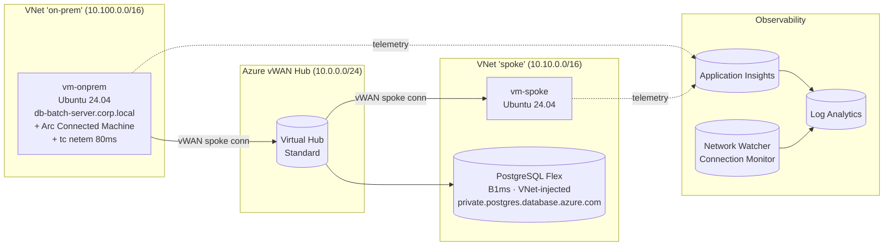

# Azure Hybrid Latency Lab

> A reproducible lab that **proves** the cost of "chatty" round-trips against a remote DB over a hybrid network — using **real Azure Virtual WAN**, an **Azure Arc–onboarded** "on-prem" Linux VM, a real **PostgreSQL Flexible Server**, and **Application Insights** to measure every single round-trip.

[](LICENSE)

## Why this exists

A common pattern in hybrid architectures: a heavy batch process running on-prem talks to a database in Azure across a long distance. The DB is fast, the link is wide, but the batch takes hours because it issues thousands of tiny queries. Each query pays a full WAN RTT.

This lab reproduces that scenario end-to-end on Azure and measures it. You get:

- A real Azure **Virtual WAN** with a Standard hub.
- A **spoke VNet** with an Azure VM and an Azure Database for **PostgreSQL Flexible Server** (VNet-injected, private DNS).
- An **"on-prem" VNet** with a Linux VM that:
  - has a `corp.local` hostname (not `.cloudapp.azure.com`),
  - reaches the DB by a custom DNS alias,
  - is **Arc-onboarded** so it shows up in Azure as a Hybrid Compute server,
  - has **`tc netem`** injecting realistic WAN latency on its egress.
- Two Python workloads doing the **same logical work** against the DB:
  - `chatty.py` — N+1 round-trips
  - `chunky.py` — set-based / `COPY` (constant round-trips)
- **Application Insights** + **Log Analytics** + **Network Watcher Connection Monitor** for end-to-end correlation.
- Generated PNG charts under `results/` using the actual telemetry from a real run.

## Architecture



## Repo layout

```
.
├── infra/             Bicep modules + deploy.sh / deploy.ps1
│   ├── main.bicep
│   └── modules/
│       ├── observability.bicep
│       ├── vwan.bicep
│       ├── spoke-network.bicep
│       ├── onprem-network.bicep
│       ├── vm.bicep
│       └── postgres.bicep
├── scripts/
│   ├── seed.py             # creates schema + N rows in PG
│   ├── chatty.py           # N+1 anti-pattern, Application Insights instrumented
│   ├── chunky.py           # bulk / set-based, same logical work
│   ├── plot_results.py     # generates charts from the run CSV
│   ├── setup_onprem.sh     # one-shot setup on the on-prem VM (DNS, deps, netem)
│   ├── run_experiments.sh  # runs N×chatty + N×chunky and writes CSV
│   └── requirements.txt
├── monitoring/
│   ├── queries.kql         # KQL for App Insights & LAW
│   └── workbook.json       # Azure Workbook
├── results/                # PNG charts + raw CSV from the actual run
├── docs/                   # supplemental docs / architecture
├── LICENSE                 # MIT
└── README.md
```

## Prerequisites

- An Azure subscription where you can create:
  - resource groups, VNets, vWAN, VMs, PostgreSQL Flexible Server, Log Analytics, Application Insights
- Local tools: **az CLI**, **bicep** (bundled), **ssh-keygen**, **bash** (or PowerShell), **python ≥ 3.10** (only needed locally if you want to regenerate charts)

## Deploy (45 min)

```bash
# 1. Generate an SSH keypair
ssh-keygen -t ed25519 -f ~/.ssh/hyblat_id_ed25519 -N '' -C hybrid-latency-lab

# 2. Login + select the right sub
az login
az account set --subscription "<your-subscription>"

# 3. Deploy
cd infra
./deploy.sh                # writes a generated PG password to stdout — save it
```

The deployment creates one resource group `rg-hybrid-latency-lab` containing:

| Resource | Purpose |
| --- | --- |
| `hyblat-vwan` + `hyblat-hub` | Virtual WAN Standard with one hub (~25 min to provision) |
| `hyblat-spoke-vnet` | Spoke VNet attached to hub |
| `hyblat-onprem-vnet` | "On-prem" VNet attached to hub |
| `hyblat-vm-spoke` | Standard_B2s, Ubuntu 24.04 |
| `hyblat-vm-onprem` | Standard_B2s, Ubuntu 24.04 |
| `hyblat-pg-…` | PostgreSQL Flexible Server B1ms, VNet-injected |
| `hyblat-law` / `hyblat-ai` | Log Analytics + Application Insights |

Ports `22/tcp` are open from the internet to both VMs (lab — restrict in production).

## Run the experiment

```bash
# pick up the deployment outputs
RG=rg-hybrid-latency-lab
PG_FQDN=$(az postgres flexible-server list -g $RG --query "[0].fullyQualifiedDomainName" -o tsv)
PG_PASSWORD="<the password printed by deploy.sh>"
APPI_CS=$(az monitor app-insights component show -g $RG -a hyblat-ai --query connectionString -o tsv)
ONPREM_IP=$(az vm show -d -g $RG -n hyblat-vm-onprem --query publicIps -o tsv)

# 1. Onboard the "on-prem" VM (DNS, deps, latency injection)
scp -i ~/.ssh/hyblat_id_ed25519 scripts/setup_onprem.sh azureuser@$ONPREM_IP:/tmp/
scp -i ~/.ssh/hyblat_id_ed25519 scripts/{chatty,chunky,seed}.py azureuser@$ONPREM_IP:/home/azureuser/latency-lab/
scp -i ~/.ssh/hyblat_id_ed25519 scripts/run_experiments.sh azureuser@$ONPREM_IP:/home/azureuser/latency-lab/
ssh -i ~/.ssh/hyblat_id_ed25519 azureuser@$ONPREM_IP \
  "sudo bash /tmp/setup_onprem.sh '$PG_FQDN' '$PG_PASSWORD' '$APPI_CS' 80"

# 2. Onboard to Azure Arc (test-mode, since it's actually an Azure VM)
ssh azureuser@$ONPREM_IP <<'EOF'
sudo MSFT_ARC_TEST=true bash -c "$(curl -fsSL https://aka.ms/azcmagent)"
sudo azcmagent connect --resource-group rg-hybrid-latency-lab --location westeurope \
   --tenant-id <TENANT_ID> --subscription-id <SUB_ID> --use-device-code
EOF

# 3. Seed the DB (run from the spoke VM where the route is short)
SPOKE_IP=$(az vm show -d -g $RG -n hyblat-vm-spoke --query publicIps -o tsv)
ssh azureuser@$SPOKE_IP \
  "PG_CONNINFO='host=$PG_FQDN dbname=latencylab user=pgadmin password=$PG_PASSWORD sslmode=require' python3 seed.py --rows 5000"

# 4. Run the experiments from the on-prem VM
ssh azureuser@$ONPREM_IP "cd /home/azureuser/latency-lab && bash run_experiments.sh 500 3"
scp -i ~/.ssh/hyblat_id_ed25519 azureuser@$ONPREM_IP:/home/azureuser/latency-lab/results-*.csv results/

# 5. Plot
python scripts/plot_results.py --csv results/results-*.csv --out results/
```

## What the charts show

Generated in `results/` after a real run:

| Chart | What it shows |
| --- | --- |
| `chart_roundtrips.png` | Mean round-trips per workload (chatty ≫ chunky). |
| `chart_duration.png` | Mean wall-clock duration. The gap is the WAN tax. |
| `chart_scatter.png` | log-log scatter of round-trips vs duration. The slope ≈ RTT. |
| `chart_per_run.png` | Run-by-run consistency check. |

## Querying telemetry yourself

See `monitoring/queries.kql`. Highlights:

- Run summary by workload (`avg_dur_ms`, `avg_rt`, **`ms_per_roundtrip`**)
- Time-series of round-trips (chatty looks like a wall, chunky looks like 2 spikes)
- Total wall-clock vs sum of dependency durations (the gap is client/CPU time)
- Connection Monitor RTT during the experiment

Import `monitoring/workbook.json` into Azure Portal → Workbooks → **+ New** → **Advanced editor** to get a pre-baked dashboard.

## Cost

≈ **$0.40/hour** while deployed:

| Resource | Cost (approx., West Europe) |
| --- | --- |
| vWAN hub Standard | $0.25/h |
| 2× B2s VMs | $0.08/h |
| PG Flex B1ms | $0.02/h |
| LAW + App Insights ingestion | a few cents/day |

**Tear it all down** with:

```bash
az group delete -n rg-hybrid-latency-lab --yes --no-wait
```

## License

MIT — see [LICENSE](LICENSE).
